# mermaid-demo

## Flowchart
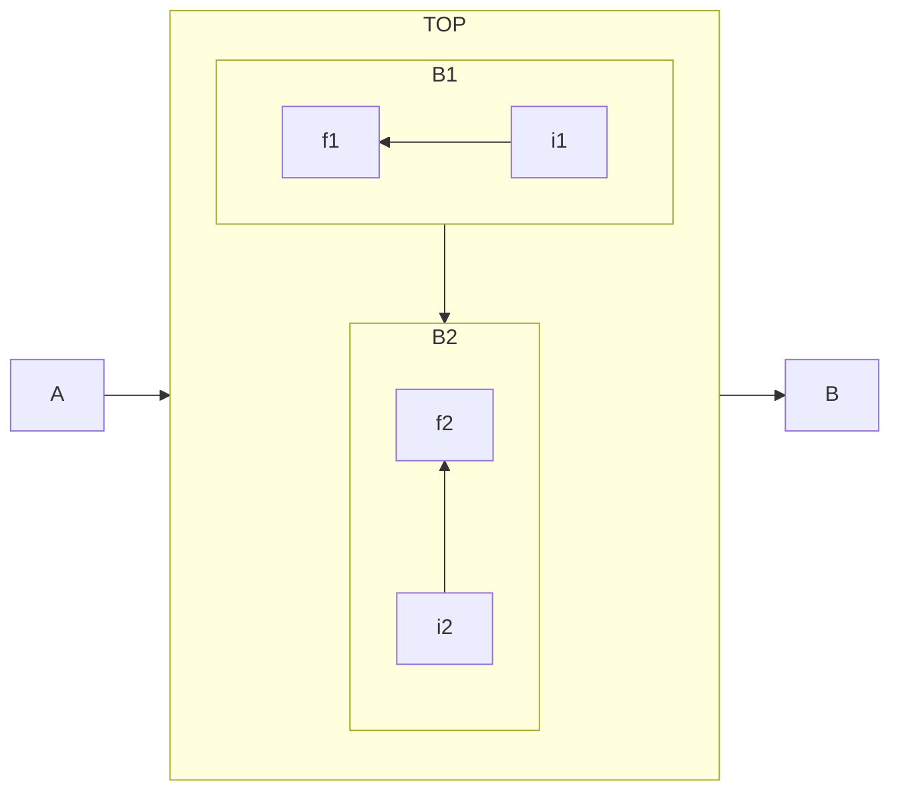

## Sequence
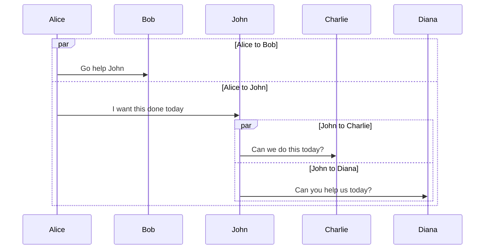

## Class

https://github.com/mermaid-js/mermaid/blob/develop/docs/syntax/classDiagram.md#visibility
https://github.com/mermaid-js/mermaid/blob/develop/docs/syntax/classDiagram.md#defining-relationship
https://github.com/mermaid-js/mermaid/blob/develop/docs/syntax/classDiagram.md#annotations-on-classes

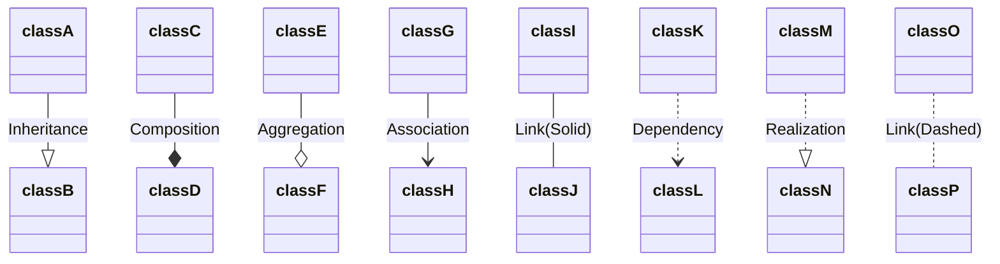

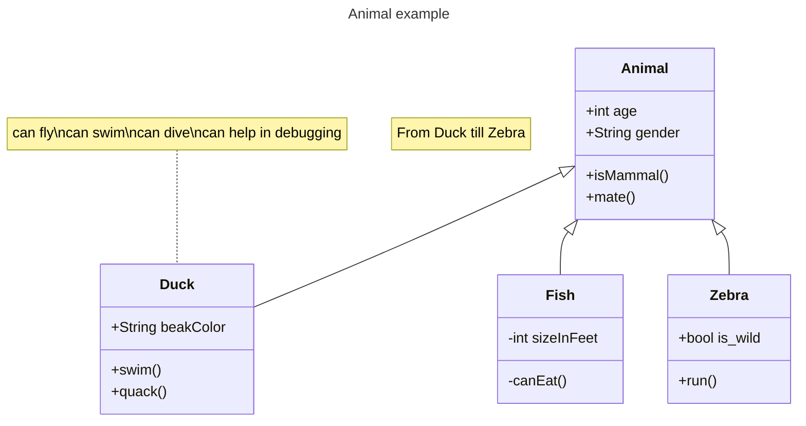

## State
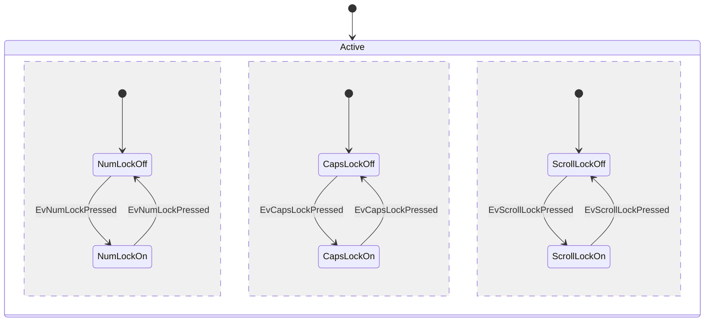

## Entity Relationship
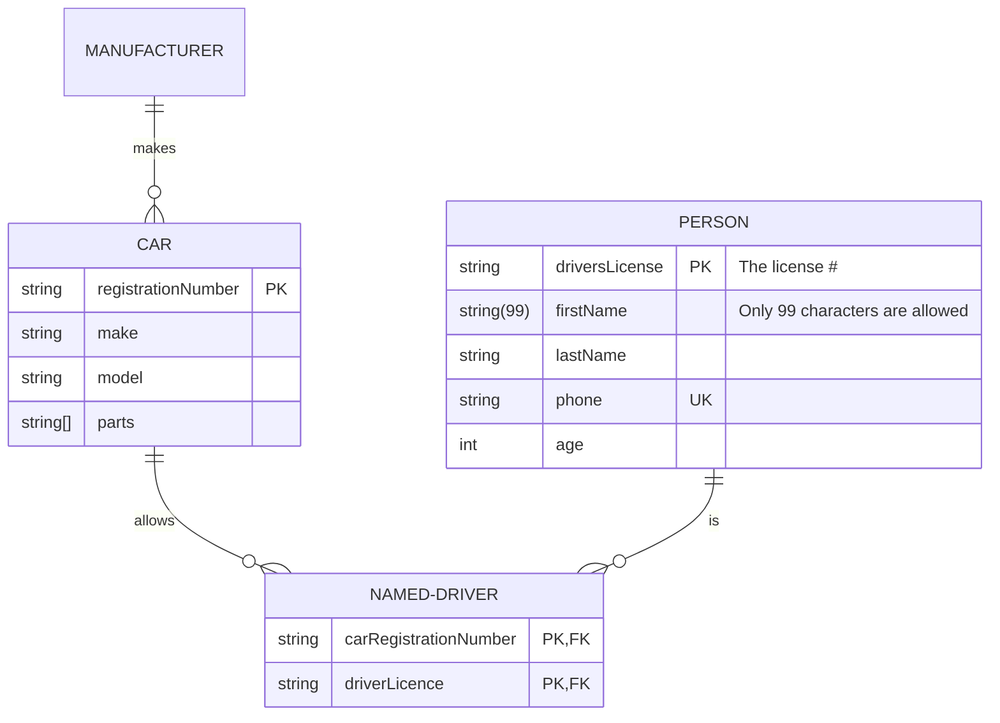

## User Journey
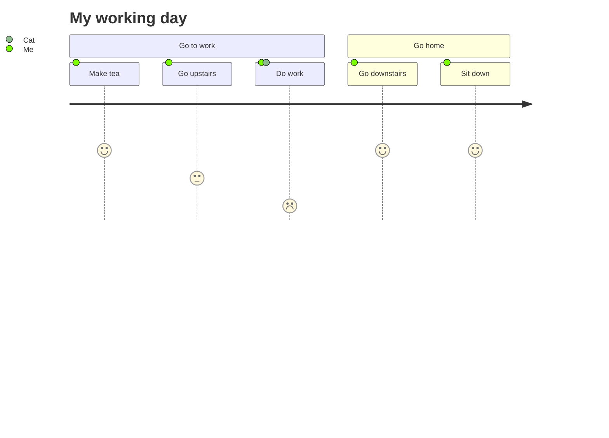

## Pie
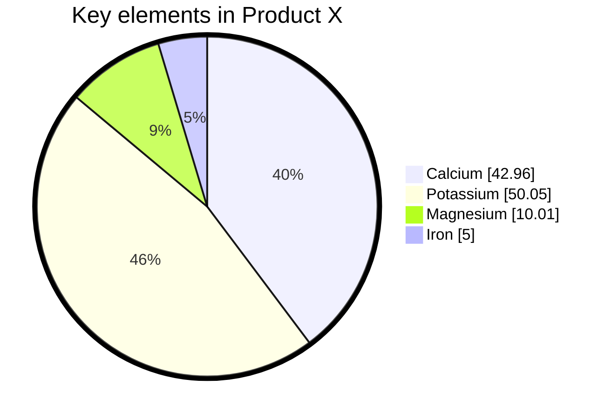

## Quadrant

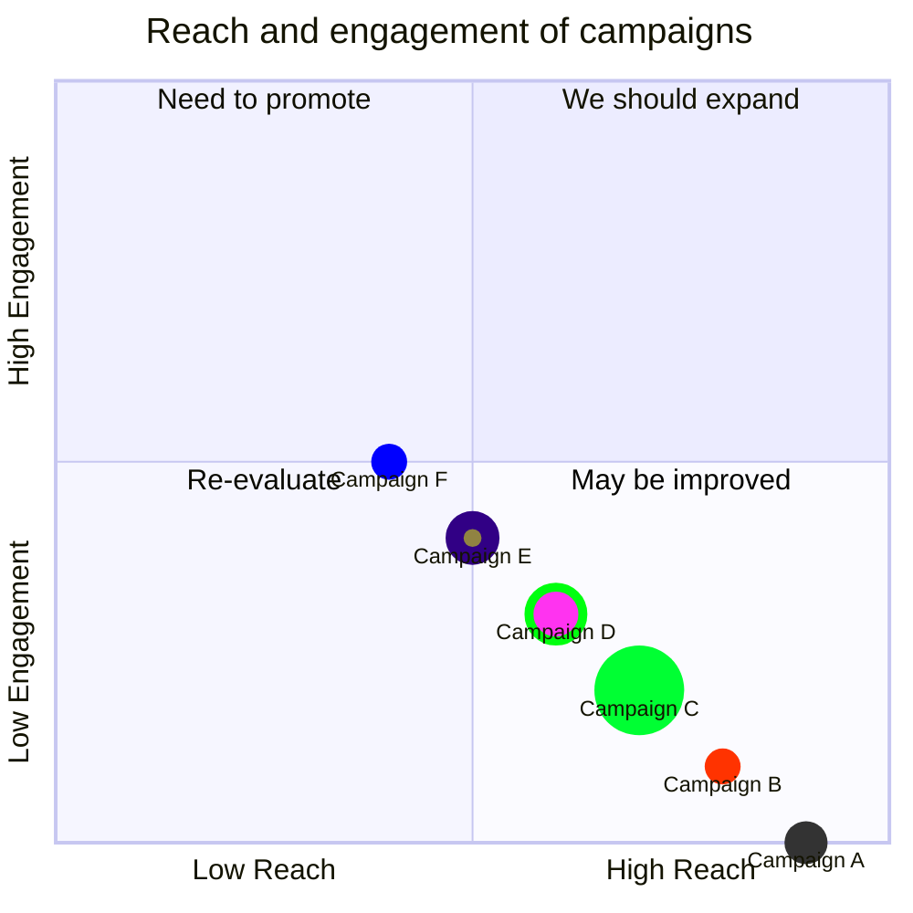

## Requirement
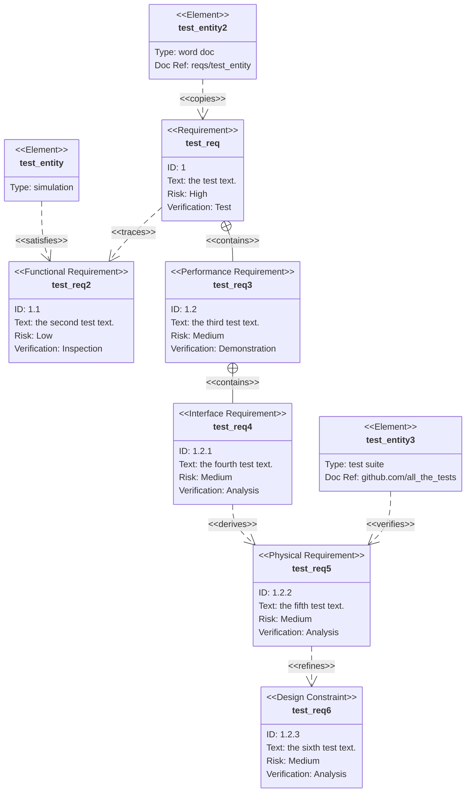

## Git
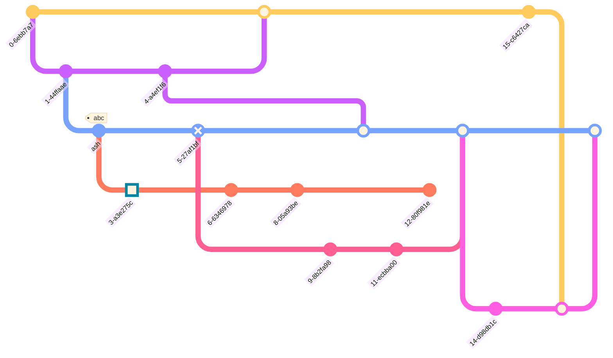

## Mindmaps
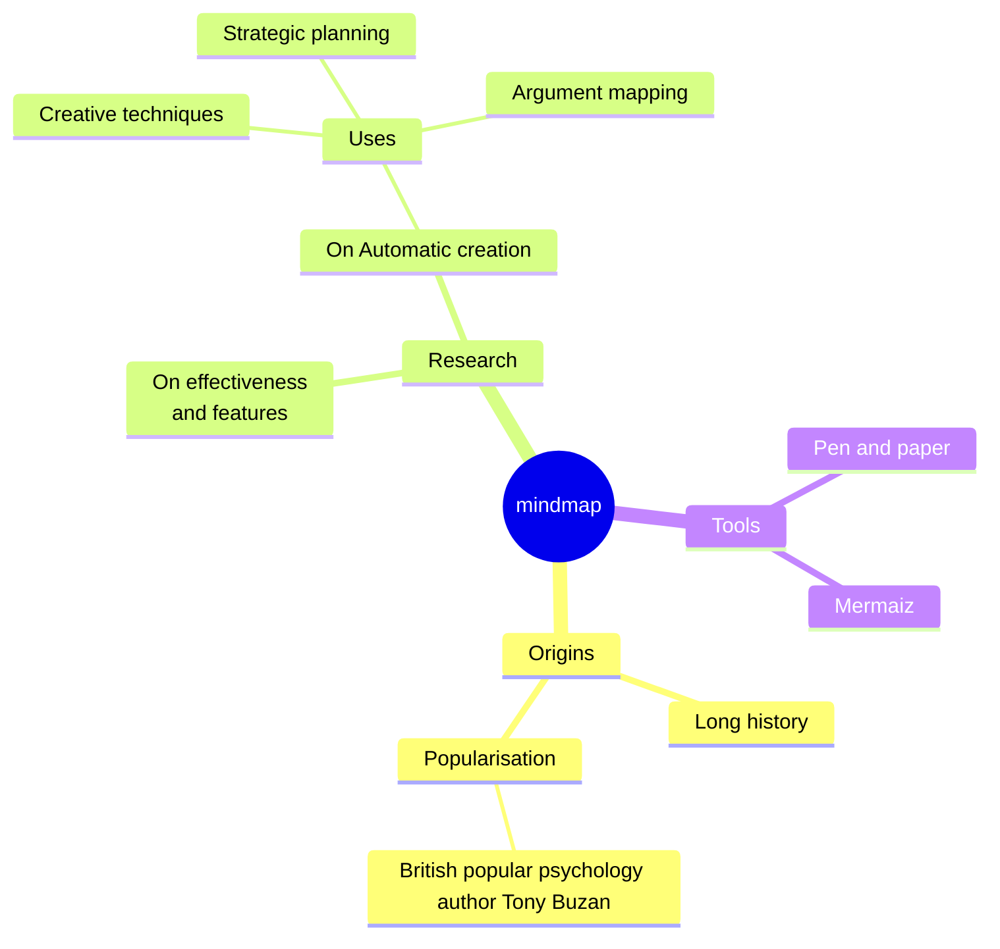

## Timeline
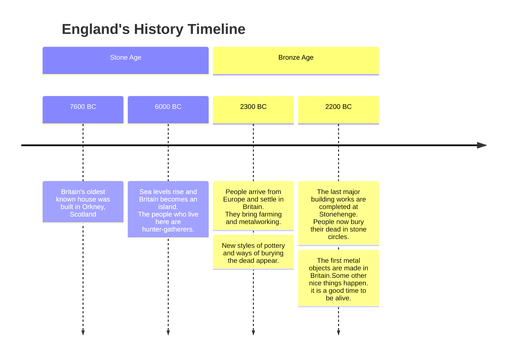
