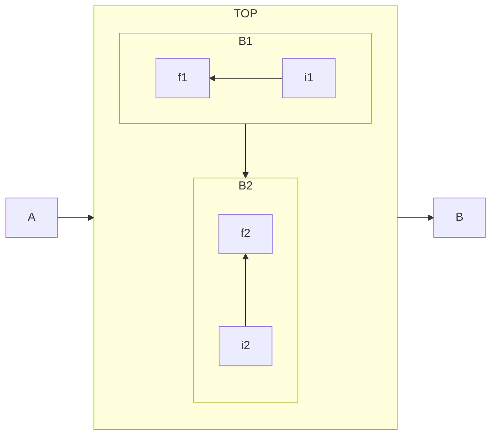
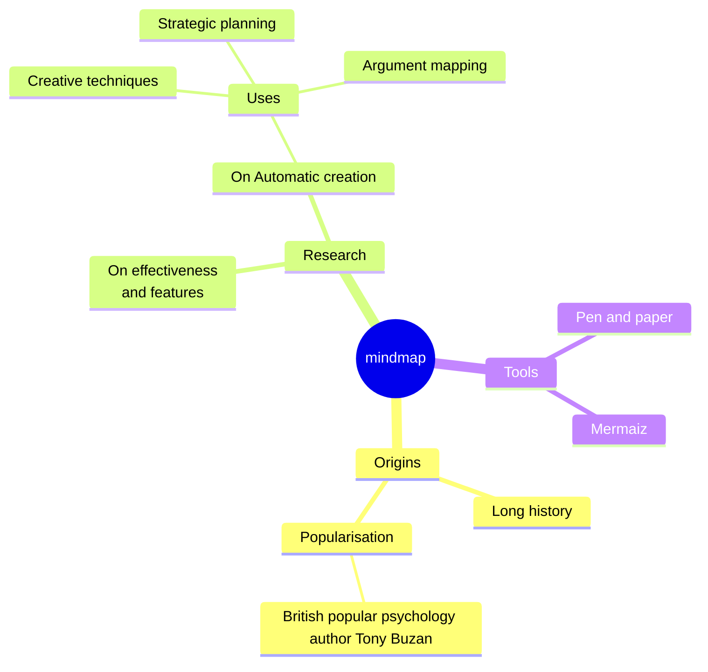

# mermaid-demo

## Flowchart

```mermaid
flowchart LR
  subgraph TOP
    direction TB
    subgraph B1
        direction RL
        i1 -->f1
    end
    subgraph B2
        direction BT
        i2 -->f2
    end
  end
  A --> TOP --> B
  B1 --> B2

```

## Mindmaps

```mermaid
mindmap
  root((mindmap))
    Origins
      Long history
      ::icon(fa fa-book)
      Popularisation
        British popular psychology author Tony Buzan
    Research
      On effectiveness<br/>and features
      On Automatic creation
        Uses
            Creative techniques
            Strategic planning
            Argument mapping
    Tools
      Pen and paper
      Mermaiz
```
